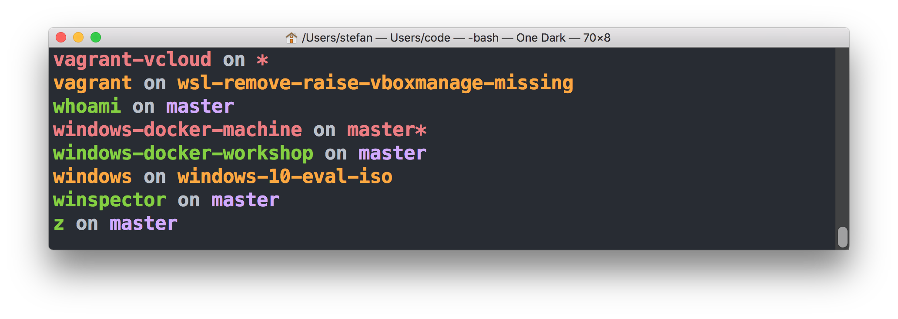

# dotfiles

Add some tweaks into current Unix/Ubuntu user's home directory.
Inspired by <https://github.com/paulirish/dotfiles> for MacOS.
For Windows I prefer my <https://github.com/StefanScherer/dotfiles-windows>.

This is what the terminal looks like


# Installation
    git clone https://github.com/StefanScherer/dotfiles && cd dotfiles && ./sync.sh

To update later on, just run the sync.sh again.

The usage of sync.sh is

```
sync.sh [--all|-a] [--force|-f]

--all|-a     install all tools, also YouCompleteMe (big dependencies)
--force|-f   force overwriting files in $HOME
```

### Tools

* [autoenv](https://github.com/kennethreitz/autoenv) - Directory-based environments
* **addtime**: show relative time stamp in stdout of another tool.
  Usage: anothertool | addtime
* **timeref**: show relative time diffs in logfile.
  Usage: timeref logfile | gvim -
* **syncfork**: fetch from upstream and merge master branch
* `Fn + F12`: toggle solarized dark/light theme in terminal
* **whoseport**: Who is running that port?
* **z**: "z foo" - cd to most frecent dir matching foo

### Aliases

* **..**: one dir up
* **...**: two dirs up
* **....**: three dirs up
* **.....**: four dirs up
* **~**: go into users home directory
* **eachdir**: start a command for all sub directories
* **fuck**: repeat last command with `sudo` ;-)
* **gi**: create `.gitignore` file, see [gitignore.io](https://gitignore.io)
* **gitcloneall**: clone all repos of an organization or user
  ```
  Usage: gitcloneall git@github.com:YOUR_ORG [user[:pass]]
  Clones all repos of a GitHub org or user.

  gitcloneall git@github.com:StefanScherer
  gitcloneall git@github.com:myorg myuser:password_to_access_private_repos
  ```
* **gitall**: start a git command for all sub directories
  ```
  gitall pull

  vi */README.md

  gitall add README.md
  gitall commit -m "updated README.md"
  gitall push
  ```
* **gitls**: show git status of all repos in current dir, you may add args like in `ls` to filter dirs
  
* **git undo-commit**: undo last commit, as it says
* **hosts**: edit your hosts file
* **logvi logfile**: view a log file with relative times in gvim
* **ssh-me**: copy my SSH key to remote machine and install my dotfiles there

### Docker

* **dps**: like `docker ps`, but with less columns
* **dm**: docker-machine shortener: `dm dev` or `dm start dev` or `dm ip dev` ...
  * **dm dev**  is a shortcut for `eval $(docker-machine env dev)`
  * also integrates my [windows-docker-machine](https://github.com/StefanScherer/windows-docker-machine)'s 2016, 1709 and insider using Vagrant to start/stop them
  * also integrates my [docker-windows-azure](https://github.com/StefanScherer/docker-windows-azure) machines az2016 and az1709 using azure cli to start/stop them

### Atom

My preferences for Atom.io are also stored here.

* **autocomplete-plus** - `keymap.cson` use ENTER instead of TAB
* **editorconfig**
* **language-batch**
* **language-powershell**

To setup Atom from scratch, first install it, then
```bash
brew cask install atom
apm install parcel
```
Then open Atom and use menu `Packages / Parcel / Sync` to install all other plugins.

### Sublime Text 3

My preferences for Sublime Text 3 are also stored in the repo. Be aware.
To have sublime in command line, I use my helper script `subl`
The following packages will be installed by Package Control

* **Ansible**
* **ApplySyntax**
* **Bats**
* **Cucumber**
* **EditorConfig**
* **GoSublime**
* **Markdown Preview**
* **PowerShell**
* **Solarized Color Scheme**
* **Solarized Toggle**


### Sublime commands

* `alt+m` open markdown file in browser

### VIM

* installs **Vundle** and some other stuff
* **EditorConfig**
* **vim-colors-solarized**

### VIM commands

* `,c`: show trailing white space
* `,ss`: strip trailing white space
* `,e`: format JavaScript code with esformatter (`npm install -g esformatter`)

# Setup a new Mac box

The simplest way to setup a new Mac box is to download and run the `setup-mac` script.

```
curl https://raw.githubusercontent.com/StefanScherer/dotfiles/master/setup-mac | bash
```

check_macos_updated
install_brew
install_dotfiles
install_solarized_profiles
install_brew_packages

1. It will run all macOS updates before it installs anything. Maybe you have to run it again after installing updates and rebooting the machine.
1. It install `brew`
1. It clones this dotfiles repo and executes the `sync.sh` script to install/update it
1. It installs the Solarized terminal profiles
1. It installs all brew packages in `brew.txt`
1. It installs all brew casks in `cask.txt`

Things you have to do manually

* Run `SizeUp` and enter the license
* Insert your Vagrant VMware license

# Licensing
Copyright (c) 2014 Stefan Scherer

MIT License, see LICENSE.txt for more details.
